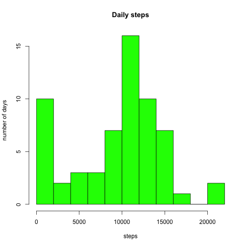
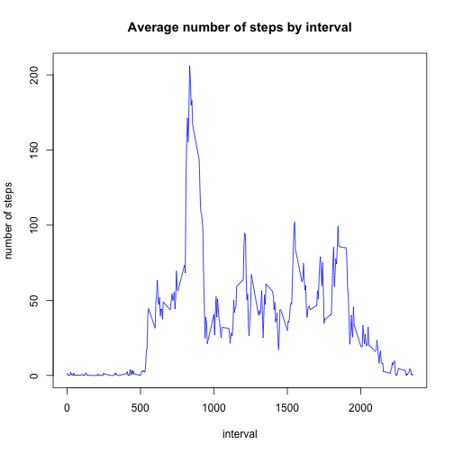
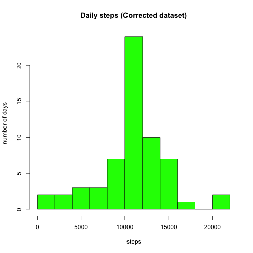
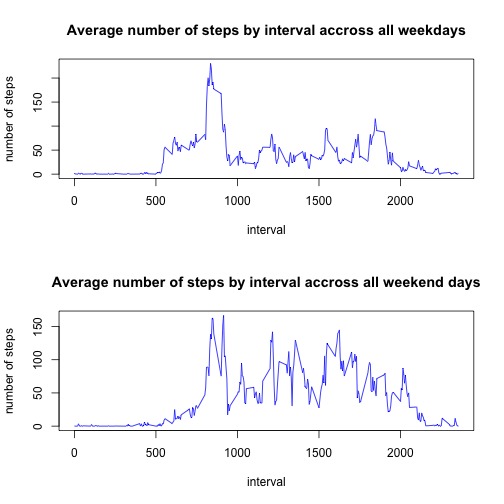

# Reproducible Research: Peer Assessment 1


## Loading and preprocessing the data

```r
activity <- read.csv(file = "activity.csv", header = TRUE, stringsAsFactors = FALSE)
activity$date <- strptime(activity$date, format = "%Y-%m-%d")
```


## What is mean total number of steps taken per day?
Plotting the histogram of the total number of steps each day.

```r
day_steps <- tapply(activity$steps, as.character(activity$date), sum, na.rm = TRUE)
hist(day_steps, breaks = 10, col = "green", main = "Daily steps", xlab = "steps", 
    ylab = "number of days")
```

 


Calculating the mean and the median of daily steps

```r
mean(day_steps)
```

```
## [1] 9354
```

```r
median(day_steps)
```

```
## [1] 10395
```


## What is the average daily activity pattern?
Plot of the 5-minute intervals and the average number of steps accross all day

```r
interval_steps <- tapply(activity$steps, activity$interval, mean, na.rm = TRUE)
plot(names(interval_steps), interval_steps, type = "l", main = "Average number of steps by interval", 
    xlab = "interval", ylab = "number of steps", col = "blue")
```

 


Find the 5-minute interval which contains the maximum average number of steps accross all days

```r
names(table(activity$interval))[which(interval_steps == max(interval_steps))]
```

```
## [1] "835"
```


## Imputing missing values
Calculate the total number of missing values in the dataset

```r
sum(is.na(activity$steps))
```

```
## [1] 2304
```


Replace NA values by **the average number of steps accross all days for the relative 5-minute interval** in a new dataset

```r
corrected_activity <- activity
NA_indexes <- is.na(corrected_activity$steps)
new_values <- round(interval_steps[as.character(corrected_activity$interval[NA_indexes])], 
    0)
corrected_activity$steps[NA_indexes] <- new_values
```


Plotting the histogram of the total number of steps each day with the corrected dataset.

```r
corrected_day_steps <- tapply(corrected_activity$steps, as.character(corrected_activity$date), 
    sum)
hist(corrected_day_steps, breaks = 10, col = "green", main = "Daily steps (Corrected dataset)", 
    xlab = "steps", ylab = "number of days")
```

 


Calculating the mean and the median of daily steps

```r
mean(corrected_day_steps)
```

```
## [1] 10766
```

```r
median(corrected_day_steps)
```

```
## [1] 10762
```


## Are there differences in activity patterns between weekdays and weekends?
Add a factor variable indicating if the given day is a weekday or a weekend day

```r
corrected_activity <- cbind(corrected_activity, day = NA)
corrected_activity$day[weekdays(corrected_activity$date, abbreviate = TRUE) %in% 
    c("Lun", "Mar", "Mer", "Jeu", "Ven")] <- "weekday"
corrected_activity$day[weekdays(corrected_activity$date, abbreviate = TRUE) %in% 
    c("Sam", "Dim")] <- "weekend"
corrected_activity$day <- as.factor(corrected_activity$day)
```


Plot the panel plot comparing the average number of steps taken per 5-minute interval accross weekdays and weekends

```r
weekday_interval_steps <- tapply(corrected_activity$steps[corrected_activity$day == 
    "weekday"], corrected_activity$interval[corrected_activity$day == "weekday"], 
    mean)
weekend_interval_steps <- tapply(corrected_activity$steps[corrected_activity$day == 
    "weekend"], corrected_activity$interval[corrected_activity$day == "weekend"], 
    mean)
par(mfrow = c(2, 1))
plot(names(weekday_interval_steps), weekday_interval_steps, type = "l", main = "Average number of steps by interval accross all weekdays", 
    xlab = "interval", ylab = "number of steps", col = "blue")

plot(names(weekend_interval_steps), weekend_interval_steps, type = "l", main = "Average number of steps by interval accross all weekend days", 
    xlab = "interval", ylab = "number of steps", col = "blue")
```

 


